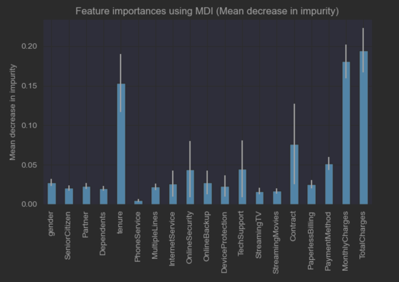
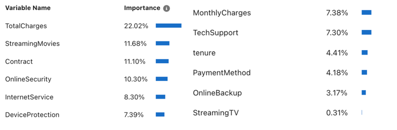
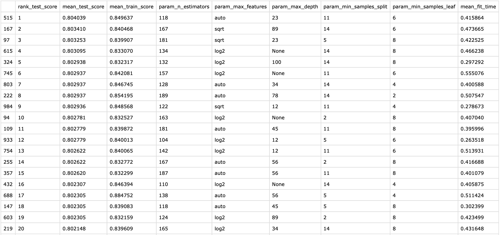
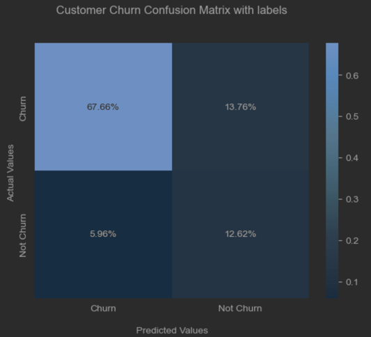
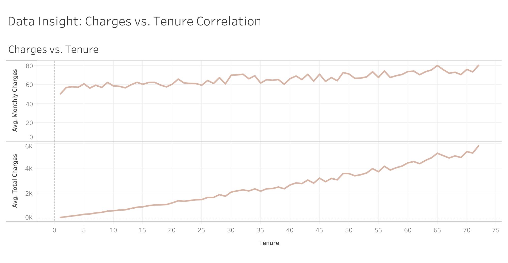
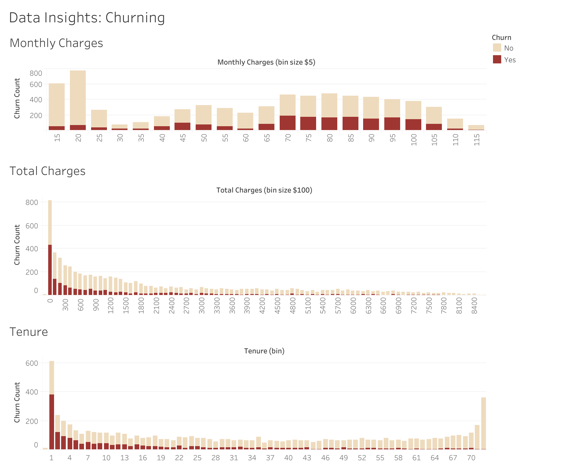
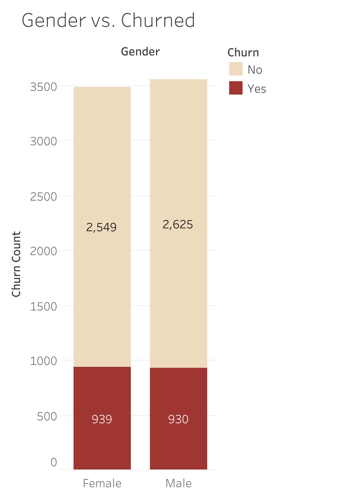
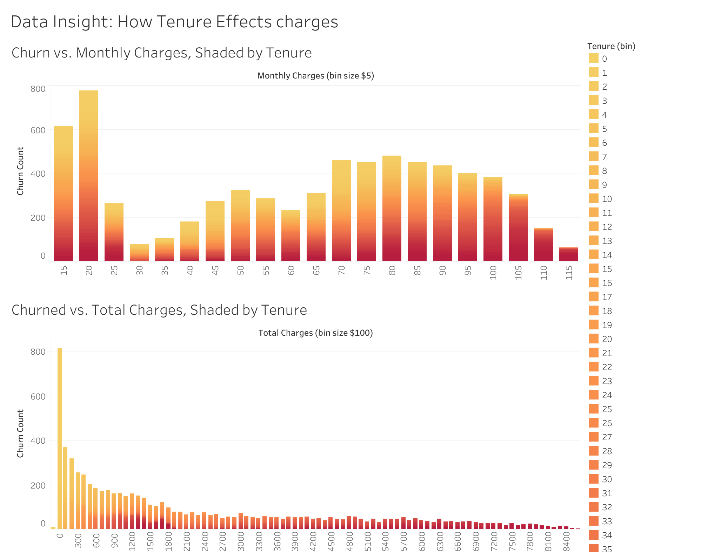

# Customer Churn Prediction using Random Forest
[View Notebook](https://github.com/Dada-Tech/customer-churn-random-forest/blob/main/random-forest-classifier.ipynb)

## Description
This project uses Supervised Learning to predict customer retention by classifying customer behaviour.
Understanding and predicting customer behaviour is crucial for business analysis and contributes to growth.

## Goals
* Use a Classifier and optimize its predictive performance.
* Benchmark the performance against most "black-box" commercial products.
* Investigate the mechanisms of overfitting, high correlation, other pitfalls of ML algorithms.

## Feature Engineering & Data Preprocessing
The dataset came with categorical data as well as some rows having missing features. Preprocessing is needed to convert this data into numerical for the random forest classifier.

* Label Encoding (converting categorical to numerical)
* Identified missing data with the TotalCharges feature
  * Replaced with the mean value of TotalCharges
```
# Label Encoding (converting categorical to numerical)
categorical_columns = [
    'gender', 'Partner', 'Dependents', 'PhoneService', 'MultipleLines','InternetService',
    'OnlineSecurity', 'OnlineBackup','DeviceProtection','TechSupport','StreamingTV',
    'StreamingMovies','Contract','PaperlessBilling','PaymentMethod', 'Churn'
]
for col in categorical_columns:
    df[col] = df[col].astype('category')
    df[col] = df[col].cat.codes

# TotalCharges Processing
df_m = df.copy()
total_charges_mean = (df_d['TotalCharges'].mean()) # mean from previously calculated dataset
df_m['TotalCharges'].replace(" ", total_charges_mean, inplace=True)
df_m['TotalCharges'] = df_m['TotalCharges'].astype(float)
```

### Features and target
```
X = df.drop("Churn", axis=1)
y = df["Churn"]
X_train, X_test, y_train, y_test = split(df.drop("Churn", axis=1),  df["Churn"], test_size=0.1)
```

### Feature Ranking
```
forest = RandomForestClassifier(random_state=0)
forest.fit(X, y)
feature_names = X.columns.values.tolist()
importances = forest.feature_importances_
std = np.std([tree.feature_importances_ for tree in forest.estimators_], axis=0)
forest_importances_mdi = pd.Series(importances, index=feature_names)
```


#### "Black-Box" Solution Feature Ranking


### Model Comparisons
RandomForest, GaussianNB, KNeighborsClassifier and LinearSVC

### Hyperparameter Optimization with Cross-Validation
We searched with RandomSearch with N = 1000 iterations and found the following results below.

```
# Optimal Hyper-parameter Search using RandomSearch
parameters = {
    'n_estimators':[int(x) for x in np.linspace(start = 100, stop = 200, num = 50)],
    'max_depth': [int(x) for x in np.linspace(1, 100, 10)],
    'max_features': ['auto', 'sqrt','log2'],
    'min_samples_split': [2, 5, 8, 11, 14],
    'min_samples_leaf': [1, 2, 4, 6, 8],
    'max_samples': [float(2/3), 0.5, None],
}
parameters['max_depth'].extend([None])
parameters['n_estimators'].extend([10])

# Classifier
rf_clf = RandomForestClassifier(oob_score=True, n_jobs=-1)

# N-iterations
n_iterations = 1000

# 10-fold cross validation
k_fold = 10

# Columns to display
df_display_columns = ['rank_test_score', 'mean_test_score', 'mean_train_score', 'param_n_estimators', 'param_max_features', 'param_max_depth', 'param_min_samples_split', 'param_min_samples_leaf', 'mean_fit_time']

# Randomized Search
clf_rs = RandomizedSearchCV(estimator=rf_clf, param_distributions=parameters, cv=k_fold, return_train_score=True, scoring='accuracy', n_iter=n_iterations)
start = time.time()
search = clf_rs.fit(X_train, y_train)
stop = time.time()
df_rs = pd.DataFrame(clf_rs.cv_results_)

print('Best Parameters', search.best_params_, '\n')
print('RandomSearch Results, Ranked by Accuracy')
print(f'Total Fit Time: {round(stop - start, 2)}s')
print(f'N-Iterations: {n_iterations}')
display(HTML(df_rs[df_display_columns].sort_values('rank_test_score').to_html()))
```
```
{'n_estimators': 118, 'min_samples_split': 11, 'min_samples_leaf': 6, 'max_samples': 0.6666666666666666, 'max_features': 'auto', 'max_depth': 23}
```


## Model Interpretability
We can see examples of underfitting, overfitting, and fitting well by altering parameters of the random forest algorithm.

1. **Maximum Depth of Trees (max_depth):**
    - When trees are limited to only 1 level, it leads to underfitting due to a lack of complexity.
    - When trees are not limited at all, they tend to overfit the training data, leading to lower scores on average.
    - Optimum performance is achieved with a maximum depth of 2, striking a balance between complexity and overfitting.

2. **Maximum number of Samples for bagging (max_samples):**
    - The number of instances added to a bootstrap sample to train a tree in the forest.
    - The conventional recommendation is 2/3 of the input dataset, but in tests, 1/2 the length of the input and even 1/10 the length produced the same performance.
    - Lower max_samples values result in quicker training times, which can be advantageous.

3. **Maximum Features for each node (max_features):**
    - Controls the number of features chosen at random for each node split.
    - Higher values reduce inter-tree correlation, making each tree's path to classification less likely to use the same feature selections.
    - Testing showed that max_features=2 performed slightly better on average, but the differences between values for this hyperparameter were not significant.

## Results
```
## based on optimal hyper-parameters
best_params = {'n_estimators': 118, 'min_samples_split': 11, 'min_samples_leaf': 6, 'max_samples': float(2/3), 'max_features': 'auto', 'max_depth': 23}
default_params = { 'oob_score': True, 'n_jobs': -1 }
best_params.update(default_params)

rfc = RandomForestClassifier(**best_params)
rfc.fit(X_train,y_train)

# Get predictions
y_pred = rfc.predict(X_test)

# Confusion Matrix
cf = skm.confusion_matrix(y_pred, y_test, normalize='all')
df_cm = pd.DataFrame(cf, index = ['Churn', 'Not Churn'],
                     columns = ['Churn', 'Not Churn'])

ax = sns.heatmap(df_cm, fmt='.2%', annot=True, cmap='Blues')
ax.set_xlabel('\nPredicted Values')
ax.set_ylabel('Actual Values ')
ax.set_title('Customer Churn Confusion Matrix with labels\n\n')

# Classification Report
print(skm.classification_report(y_pred, y_test))

plt.show()
```


```
              precision    recall  f1-score   support

           0       0.92      0.83      0.87       574
           1       0.48      0.68      0.56       131

    accuracy                           0.80       705
   macro avg       0.70      0.76      0.72       705
weighted avg       0.84      0.80      0.81       705
```

# Data Insights



